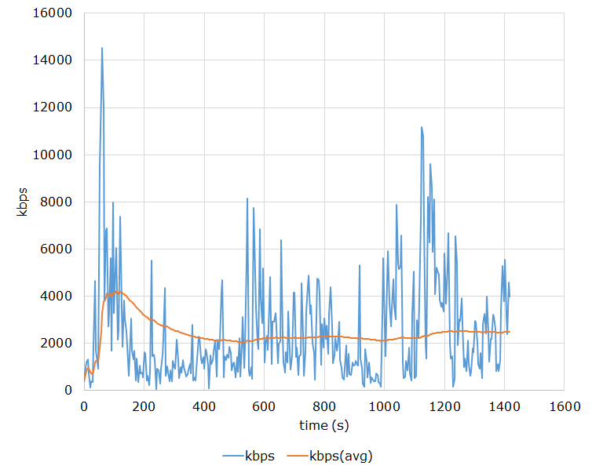

# CheckBitrate
[](https://ci.appveyor.com/project/rigaya/checkbitrate)  [](https://github.com/rigaya/CheckBitrate/actions/workflows/build_packages.yml)  

動画ファイルを分析して、ビットレート分布をcsvで出力します。  
csvをエクセルなりなんなりでグラフにしてみてください。

## ダウンロード & 更新履歴
[github releases>>](https://github.com/rigaya/CheckBitrate/releases)

## 動作環境
Windows 10 (x86/x64)  
Linux

## 使用方法
```bat
CheckBitrate.exe　[オプション] <動画ファイル1> [<動画ファイル2>]...
```
チェックしたい動画ファイルをドラッグ&ドロップしてください。
&lt;動画ファイル&gt;.trackID.bitrate.csvに解析結果が出力されます。

### オプション

_-i &lt;float&gt;_  
ビットレートの分布のおおよその分解能を秒単位で指定。フレームレートとの兼ね合いできっちり指定した値で分析されるわけではありません。  
デフォルトでは0.5～4.0秒の間で適当に決まります。

## 出力ファイル例
[出力ファイル例 (csv)](./example/example.csv)  

Excel等でグラフにするとこんな感じになります。



## CheckBitrate 使用にあたっての注意事項
無保証です。自己責任で使用してください。  
CheckBitrateを使用したことによる、いかなる損害・トラブルについても責任を負いません。
